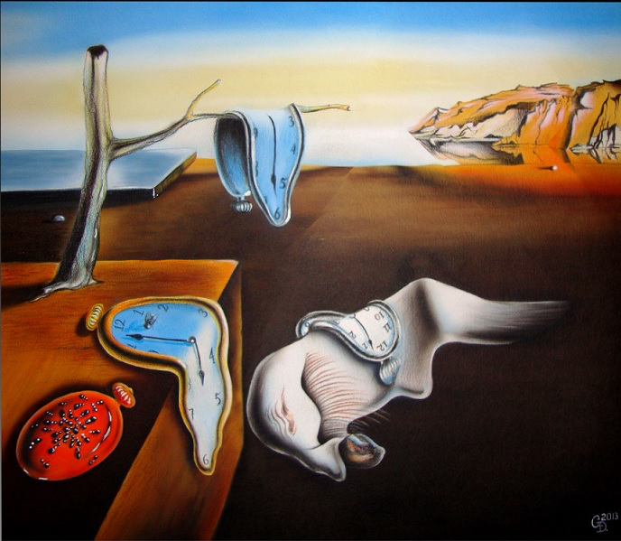

# Seam Carving: Content-Aware Image Resizing with Dynamic Programming

Xcode playground que apresenta como a programação dinâmica pode ser utilizada no método de redimensionamento de imagens considerando o seu conteúdo.

## Example

### Surfer
Input:

Output:

### POM

Input:

Output:

